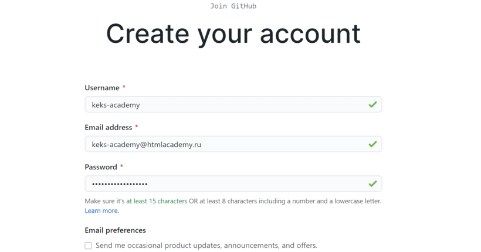

# GITHub

``Github`` — это очень известная платформа для хранения, распространения и управления исходным кодом открытых проектов. Github использует множество разработчиков по всему миру, среди которых есть и крупные компании, такие как  ``Microsoft``, ``RedHat`` и другие.

Github предоставляет возможности не только по просмотру кода и его распространения, но также историю версий, инструменты совместной разработки, средства для предоставления документации, выпуска релизов и обратной связи. И самое интересное, что вы можете размещать на Gihub как открытые, так и приватные проекты. В этой статье мы рассмотрим как пользоваться Github для размещения своего проекта.

Но первое что нужно сделать это создать свой аккаунт.

  1. Переходим на Github [``Жмем сюда``](https://github.com/), находим и нажимаем кнопку «Sign up» (зарегистрироваться).
  2. На странице регистрации вам предложат ввести обязательные данные:
     * имя пользователя;
     * адрес электронной почты;
     * пароль
  

  1. После на указанную ранее почту придёт письмо с просьбой подтвердить электронный адрес.
  2. Для завершения регистрации пройдите по полученной ссылке.
  3. Аккаунт для Github создан, всё готово к дальнейшей работе.

[<<Главное меню](./readme.md)
