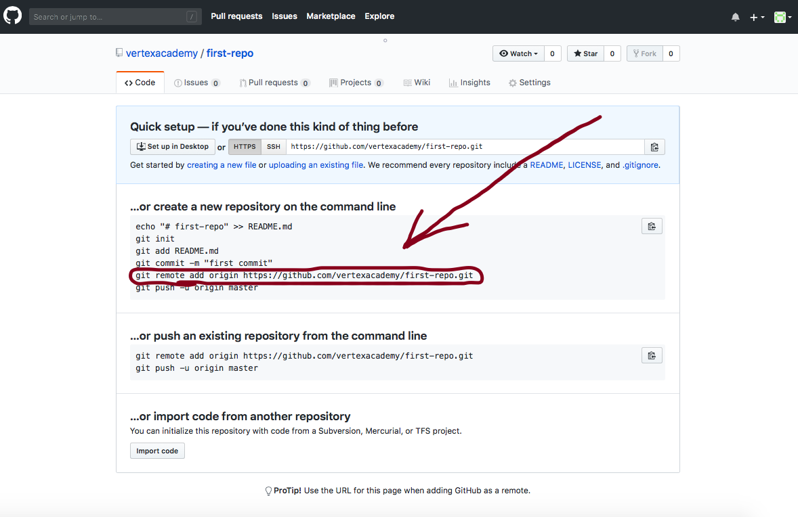

# <span style="color:green">Создаем удаленный репозиторий через терминал VS code.</span>
  
 1. В верхней консоли нажимаем опцию "Терминал".
 2. Внизу появится окошко.
 3. Вводим первую команду

    ```
    git init.
    ```

 4. Чтобы Git epyfkувас нужно ввести свои данные. Имя и электронную почту.

    ```
    git config --global user.name "Your Name"<br>
    git config --global user.email "Your_email"
    ```

 5. Cледующая команда для ввода:

    ```
    git add .
    ```

 6. Для проверки статуса вводим команду:

    ```
    git status
    ```

 7. Вводим команду для записи индексированных изменений в репозиторий (ваш первый коммит).

    ```
    git commit -m "initial commit"
    ```

 8. Затем вводим адрес вашего репозитория. Скопируйте его.
   
 9. И последняя команда для ввода. Отправляем данные.

    ```
    git push -u origin master
    ```

[<<Главное меню](./readme.md)