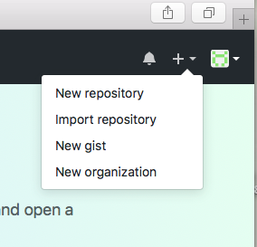
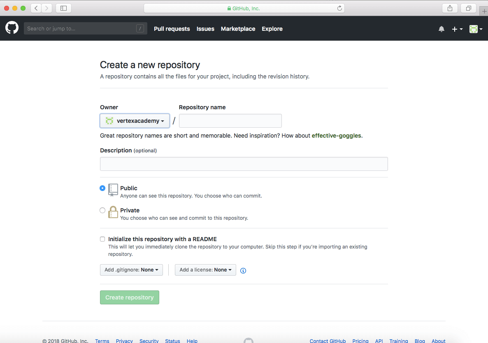
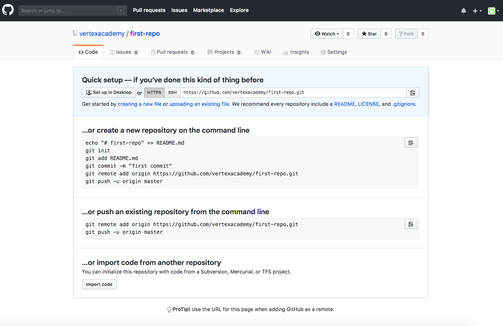

## Как создать репозиторий на GitHub

Как только Вы создали аккаунт (см. статью [Github](./github.md)), перед Вами должно появиться похожее окно:

В самом верху, страница предлагает Вам прочитать гид по сайту. Вы можете сделать это в свободное время для лучшего знакомства с функционалом страницы.

___

Итак: если нажать на иконку справа, появится меня для управления учётной записью:

Если нажать на плюс, откроется выпадающее меню:

Здесь можно:

+ создать новый репозиторий ("New repository")
+ импортировать репозиторий ("Import repository")
+ новый gist ("New gist") - что-то наподобие статьи в блог
+ новая организация ("New organisation") - например, Вы можете создать организацию, с которой можно связывать учётные записи на GitHub.
  
Создаем первый репозиторий.

1. Нажимаем "New repository"

Появится это окно:

1. Сверху вы видите владельца репозитория (вас) и название репозитория которое вы должны дать. Например Task_1.
2. Затем мы можем выбрать, будет ли наш проект публичным (т.е. все смогут его видеть), или приватным. На бесплатных аккаунтах GitHub предоставляет безграничное хранилище только для публичных проектов. Поэтому выбираем публичный (Public).
3. На этом мы можем остановиться и нажать зеленую кнопку Создать репозиторий ("Create repository").
4. Теперь Вы должны видеть перед собой такую страницу:

+ Вот мы и создали свой первый репозиторий на GitHub. Теперь он появится у Вас в разделе "Репозитории" на главной странице:

[<<Главное меню](./readme.md)
