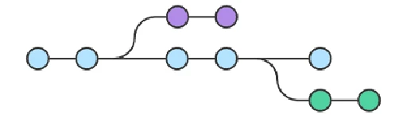

#  Что такое ветка?

***Ветка*** — это указатель какого-либо коммита. Когда ветка указывает на какой-то коммит, к ней относятся и все те которые были до него.

Исходя из этого можно сказать, что веток, указывающих на один и тот же коммит, может быть сколько угодно.

Работа происходит в ветках, поэтому когда создается новый коммит, ветка переносит свой указатель на более новый коммит.

[<<Главное меню](./readme.md)